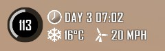

# 7 Days to Die UI Mod

Улучшенный интерфейс для игры, без установки дополнительного контента на клиента. 
Разрабатывался для использования на сервере, но можно использовать и для однопользовательской игры. 
Архив с модом доступен на странице https://github.com/sovicUA/7dtd-ui-mod/releases

# Индикатор дня/орды
Обычный день
---

---
За два дня до орды
---

---
В день орды
---

